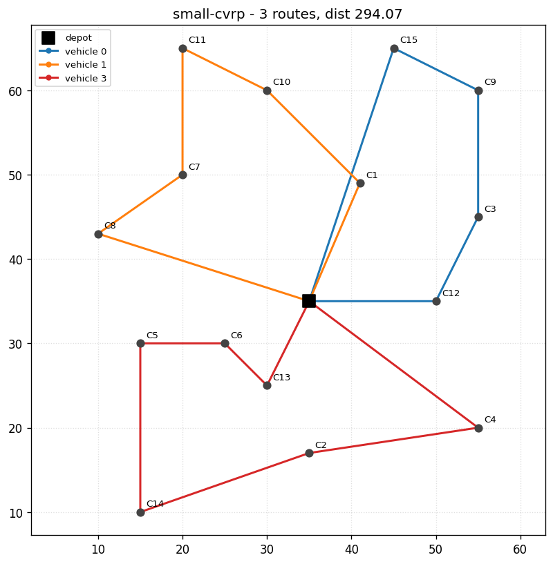

# vehicle-routing-solver

A practical, well-tested **Vehicle Routing Problem (VRP)** solver built on
[Google OR-Tools](https://developers.google.com/optimization/routing). Give it a
depot, a list of stops with demands, and a fleet — it returns the set of routes
that serves every stop at the lowest total distance, respecting vehicle
**capacity** and optional delivery **time windows**.

```
depot -> C12 -> C3  -> C9  -> C15 -> depot      load 24/25   dist 83.98
depot -> C1  -> C10 -> C11 -> C7 -> C8 -> depot  load 24/25   dist 95.42
depot -> C13 -> C6  -> C5  -> C14 -> C2 -> C4 -> depot  load 25/25   dist 114.67
```



---

## Table of contents

1. [What problem does this solve?](#what-problem-does-this-solve)
2. [Features](#features)
3. [Install](#install)
4. [Quick start](#quick-start)
5. [Tutorial 1 — Capacitated routing (CVRP)](#tutorial-1--capacitated-routing-cvrp)
6. [Tutorial 2 — Time windows (VRPTW)](#tutorial-2--time-windows-vrptw)
7. [Tutorial 3 — Real-world maps with lat/lon](#tutorial-3--real-world-maps-with-latlon)
8. [Tutorial 4 — Using the Python API](#tutorial-4--using-the-python-api)
9. [Input format](#input-format)
10. [How it works](#how-it-works)
11. [Project layout](#project-layout)
12. [Running the tests](#running-the-tests)
13. [FAQ / troubleshooting](#faq--troubleshooting)

---

## What problem does this solve?

You run a depot with a fleet of vehicles. Every day you get a list of customers,
each needing a certain quantity of goods. You want to answer:

* How many vehicles do I actually need today?
* Which customers should each vehicle visit, and in what order?
* What is the shortest total driving distance that still serves everyone?

This is the **Capacitated Vehicle Routing Problem**. It is NP-hard, so for any
realistic size we use OR-Tools' constraint-programming engine with local-search
metaheuristics to find very good solutions quickly, rather than brute force.

## Features

- **CVRP** — capacity-constrained routing for a homogeneous fleet.
- **VRPTW** — add `[ready_time, due_time]` windows and per-stop service times.
- **Two distance metrics** — flat-plane Euclidean and great-circle (haversine)
  for real latitude/longitude data.
- **Drop penalties** — when the fleet is too small, optionally skip the least
  worthwhile stops instead of failing outright.
- **Matplotlib visualisation** — render the routes to a PNG.
- **JSON instances** — describe problems in a tiny, readable format.
- **Tested** — a `pytest` suite covers the model, both metrics and the solver.

## Install

Requires **Python 3.9+**.

```bash
git clone https://github.com/KNCn23/vehicle-routing-solver.git
cd vehicle-routing-solver
python -m pip install -r requirements.txt
```

That pulls in `ortools` (the solver), `matplotlib` (plotting) and `pytest`
(tests).

> Working on an externally-managed Python (Homebrew, Debian)? Either create a
> virtual environment (`python -m venv .venv && source .venv/bin/activate`) or
> add `--break-system-packages` to the pip command.

## Quick start

Solve the bundled 15-stop instance:

```bash
python cli.py data/example_small.json
```

Add a picture of the result:

```bash
python cli.py data/example_small.json --plot routes.png
```

Run the scripted API tour:

```bash
python examples/quickstart.py
```

---

## Tutorial 1 — Capacitated routing (CVRP)

**Goal:** deliver to 15 customers from one depot using vehicles that carry at
most 25 units each.

1. Open [`data/example_small.json`](data/example_small.json). It lists a depot
   (`demand: 0`) and 15 customers, each with an `x`, `y` position and a
   `demand`. The fleet block says we have 4 vehicles of capacity 25.

2. Solve it:

   ```bash
   python cli.py data/example_small.json --time-limit 5
   ```

3. Read the output. Each line is one vehicle's route, its carried load versus
   capacity, and the route distance. The footer shows how many vehicles were
   actually needed (only 3 of the 4) and the total distance.

4. **Experiment:** lower the capacity to `15` in the JSON and re-run. The total
   demand (73) now needs at least ⌈73/15⌉ = 5 vehicles, but only 4 exist, so the
   solver reports *no feasible solution*. Add `--allow-dropping` to serve as many
   stops as possible and list the ones it had to skip:

   ```bash
   python cli.py data/example_small.json --allow-dropping
   ```

## Tutorial 2 — Time windows (VRPTW)

**Goal:** the same idea, but every customer can only be served inside a time
window, and each visit takes some service time.

1. Look at [`data/example_timewindows.json`](data/example_timewindows.json).
   Each stop adds three fields: `ready_time` (earliest start), `due_time`
   (latest start) and `service_time` (minutes spent at the stop).

2. Solve it — the solver detects the windows automatically:

   ```bash
   python cli.py data/example_timewindows.json --time-limit 5
   ```

3. Notice how the routes now cluster stops whose windows are close in time
   (the early-window customers C1–C3 end up on one vehicle, the late-window
   C7–C9 on another). The solver adds a hidden "Time" dimension and forbids any
   route that would arrive after a stop's `due_time`.

> **Units matter.** Travel time is taken to equal travel distance (unit speed),
> so keep your time windows in the same scale as your coordinates. If a vehicle
> covers 2 distance units per minute, divide the travel term — see the
> `time_cb` comment in [`vrp/solver.py`](vrp/solver.py).

## Tutorial 3 — Real-world maps with lat/lon

If your coordinates are real latitudes and longitudes, switch the metric to
`haversine` so distances are great-circle metres instead of plane units. Put the
**latitude in `x`** and the **longitude in `y`**:

```json
{
  "name": "city-run",
  "vehicle": { "count": 2, "capacity": 100 },
  "locations": [
    { "name": "warehouse", "x": 41.0082, "y": 28.9784, "demand": 0 },
    { "name": "kadikoy",   "x": 40.9833, "y": 29.0333, "demand": 30 },
    { "name": "besiktas",  "x": 41.0422, "y": 29.0083, "demand": 25 }
  ]
}
```

```bash
python cli.py city-run.json --metric haversine
```

Distances in the report are now in kilometres.

## Tutorial 4 — Using the Python API

Build and solve a problem entirely in code:

```python
from vrp import Location, Problem, Vehicle, euclidean_matrix, solve
from vrp.io_utils import format_solution

problem = Problem(
    name="bakery-run",
    locations=[
        Location("depot", 0, 0),
        Location("cafe",  5, 1, demand=5),
        Location("hotel", -3, 2, demand=4),
        Location("school", 1, -4, demand=6),
    ],
    vehicle=Vehicle(count=2, capacity=12),
)

matrix = euclidean_matrix(problem)
solution = solve(problem, matrix, time_limit_s=3)

print(format_solution(problem, solution))
for route in solution.routes:
    if route.is_used:
        print(route.vehicle, route.stops, route.distance)
```

`solve()` returns a `Solution` with a `routes` list, `total_distance`, and the
`dropped` stops (empty unless `allow_dropping=True`).

## Input format

A problem is a JSON object:

| Field        | Type   | Required | Meaning                                  |
|--------------|--------|----------|------------------------------------------|
| `name`       | string | no       | Instance label.                          |
| `depot`      | int    | no       | Index of the depot (default `0`).        |
| `vehicle`    | object | yes      | `{ "count": int, "capacity": int }`.     |
| `locations`  | array  | yes      | List of stops; index 0 is usually depot. |

Each location:

| Field          | Type   | Default | Meaning                                |
|----------------|--------|---------|----------------------------------------|
| `name`         | string | `stopN` | Label shown in output.                 |
| `x`, `y`       | number | —       | Coordinates (plane, or lat/lon).       |
| `demand`       | int    | `0`     | Units required (depot is `0`).         |
| `ready_time`   | int    | `0`     | Earliest service start (VRPTW).        |
| `due_time`     | int    | `0`     | Latest service start; `0` = no window. |
| `service_time` | int    | `0`     | Time spent at the stop (VRPTW).        |

## How it works

1. **Model** ([`vrp/model.py`](vrp/model.py)) — plain dataclasses validate the
   instance (e.g. a stop demanding more than a vehicle can carry is rejected up
   front).
2. **Distance matrix** ([`vrp/distance.py`](vrp/distance.py)) — coordinates are
   turned into an integer cost matrix. OR-Tools needs integers, so distances are
   scaled by 1000 before rounding to keep three decimals of precision.
3. **Solve** ([`vrp/solver.py`](vrp/solver.py)) — we build a
   `RoutingModel`, register the distance arc-cost, add a **Capacity** dimension,
   and — when windows are present — a **Time** dimension. The search starts from
   a cheap greedy route (`PATH_CHEAPEST_ARC`) and improves it with **Guided
   Local Search** until the time limit.
4. **Report** ([`vrp/io_utils.py`](vrp/io_utils.py), [`vrp/plot.py`](vrp/plot.py))
   — the assignment is walked back into routes and printed or plotted.

## Project layout

```
vehicle-routing-solver/
├── cli.py                 # command-line entry point
├── vrp/
│   ├── model.py           # Location / Vehicle / Problem dataclasses
│   ├── distance.py        # euclidean + haversine matrix builders
│   ├── solver.py          # OR-Tools CVRP / VRPTW solver
│   ├── io_utils.py        # JSON loading + solution formatting
│   └── plot.py            # matplotlib route rendering
├── data/                  # example instances
├── examples/quickstart.py # minimal API demo
└── tests/                 # pytest suite
```

## Running the tests

```bash
python -m pytest -q
```

The suite checks matrix symmetry, a known haversine distance (Istanbul→Ankara
≈ 350 km), that capacity is never exceeded, that infeasible instances are
reported correctly, and that drop penalties recover a partial plan.

## FAQ / troubleshooting

**"No feasible solution found."**
The fleet cannot serve the total demand within capacity (or the time windows are
impossible). Add vehicles, raise capacity, widen the windows, or pass
`--allow-dropping`.

**The solver is slow / I want a better answer.**
Increase `--time-limit`. Routing is an optimisation, not a one-shot computation:
more time generally yields shorter routes until it converges.

**My distances look huge.**
They are reported in the metric's own unit. Euclidean uses your coordinate
units; haversine uses kilometres. Internally everything is scaled by 1000.

## License

[MIT](LICENSE)
